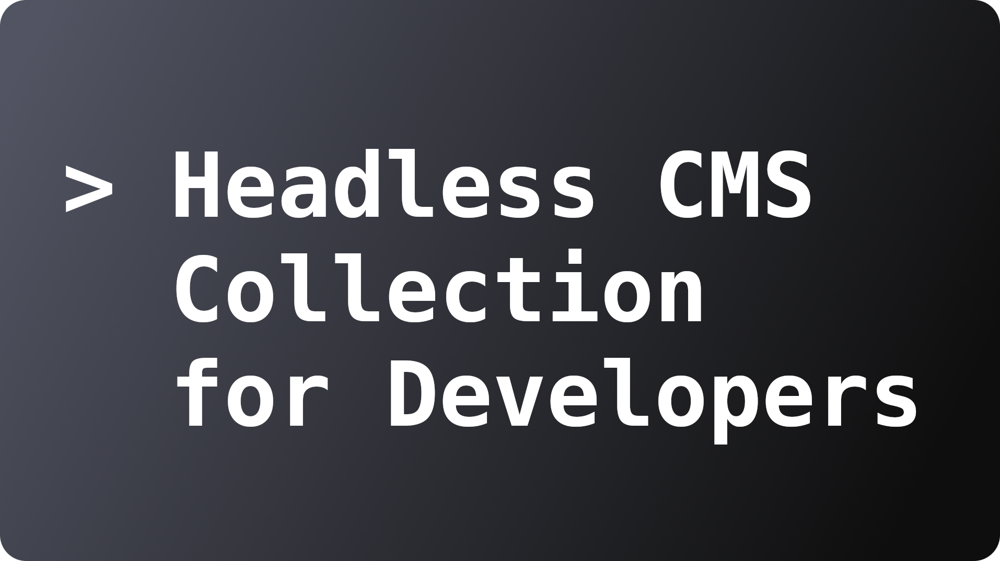

This repo collects headless CMS that are either open source, or have at least a free developer account in the cloud version.

No claim to completeness, this is just a repository to list some headless CMS that can be found on the web. If you know or find more headless CMS that are either open source or include a free developer account, feel free to contribute.

If you find information that is not listed correctly, feel free to contribute as well.

- [Directus](#directus)
- [Keystone](#keystone)
- [Payload](#payload)
- [Statamic](#statamic)
- [Webiny](#webiny)
- [TinaCMS](#tinacms)
- [Ghost](#ghost)
- [Cockpit](#cockpit)
- [Contember](#contember)
- [CraftCMS](#craftcms)
- [Strapi](#strapi)
- [ApostropheCMS](#apostrophecms)
- [Flextype](#flextype)
- [Publii](#publii)
- [Pimcore](#pimcore)
- [Gentics](#gentics)
- [Superdesk](#superdesk)
- [dotCMS](#dotcms)
- [Squidex](#squidex)
- [NetlifyCMS](#netlifycms)
- [Daptin](#daptin)
- [Flotiq](#flotiq)
- [Gridly](#gridly)
- [DatoCMS](#datocms)
- [Sanity](#sanity)
- [Cosmic](#cosmic)
- [TakeShape](#takeshape)
- [Prepr](#prepr)
- [Prismic](#prismic)
- [Contentful](#contentful)
- [Hygraph (GraphCMS)](#hygraph-graphcms)
- [Storyblok](#storyblok)
- [ButterCMS](#buttercms)
- [Zesty](#zesty)
- [Dialoguewise](#dialoguewise)
- [Kontent](#kontent)

---

### Directus

:link: https://directus.io/  
:heavy_check_mark: Free developer account in cloud version  
:heavy_check_mark: Open Source version, self-hosted  
:heart: https://github.com/directus

---

### Keystone

:link: https://keystonejs.com/  
:heavy_check_mark: Open Source version, self-hosted  
:heart: https://github.com/keystonejs

---

### Payload

:link: https://payloadcms.com/  
:heavy_check_mark: Open Source version, self-hosted  
:heart: https://github.com/payloadcms

---

### Statamic

:link: https://statamic.com/  
:heavy_check_mark: Open Source version, self-hosted  
:heavy_check_mark: Free developer account in cloud version  
:heart: https://github.com/statamic/cms

---

### Webiny

:link: https://www.webiny.com/  
:heavy_check_mark: Open Source version, self-hosted  
:heart: https://github.com/webiny

---

### TinaCMS

:link: https://tina.io/  
:heavy_check_mark: Open Source version  
:heart: https://github.com/tinacms

---

### Ghost

:link: https://ghost.org/  
:heavy_check_mark: Open Source version, self-hosted  
:x: Free developer account in cloud version  
:heart: https://github.com/TryGhost

---

### Cockpit

:link: https://getcockpit.com/  
:heavy_check_mark: Open Source version, self-hosted  
:heart: https://github.com/agentejo/cockpit

---

### Contember

:link: https://www.contember.com/  
:heavy_check_mark: Open Source version, self-hosted  
:x: Free developer account in cloud version  
:heart: https://github.com/contember/admin

---

### CraftCMS

:link: https://craftcms.com/  
:heavy_check_mark: Open Source version, self-hosted  
:heavy_check_mark: Free developer account in cloud version  
:heart: https://github.com/craftcms

---

### Strapi

:link: https://strapi.io/  
:heavy_check_mark: Open Source, self-hosted  
&#10067; Free developer account (Cloud version coming soon)  
:heart: https://github.com/strapi

---

### ApostropheCMS

:link: https://apostrophecms.com/  
:heavy_check_mark: Open Source version, self-hosted  
:x: Free developer account  
:heart: https://github.com/apostrophecms

---

### Flextype

:link: https://awilum.github.io/flextype/  
:heavy_check_mark: Open Source version, self-hosted  
:heart: https://github.com/flextype/flextype

---

### Publii

:link: https://getpublii.com/  
:heavy_check_mark: Open Source, self-hosted  
:heart: https://github.com/GetPublii/Publii

---

### Pimcore

:link: https://pimcore.com/en  
:heavy_check_mark: Open Source version, self-hosted  
:x: Free developer account in cloud version  
:heart: https://github.com//pimcore/pimcore

---

### Gentics

:link: https://github.com/gentics  
:heavy_check_mark: Open Source, self-hosted  
:heart: https://github.com/gentics/mesh

---

### Superdesk

:link: https://www.superdesk.org/  
:heavy_check_mark: Open Source version, self-hosted  
:x: Free developer account in cloud version  
:heart: https://github.com/superdesk/superdesk

---

### dotCMS

:link: https://www.dotcms.com/  
:heavy_check_mark: Open Source version, self-hosted  
:x: Free developer account in cloud version  
:heart: https://github.com/dotCMS/core

---

### Squidex

:link: https://squidex.io/  
:heavy_check_mark: Free developer account in cloud version  
:heavy_check_mark: Open Source version, self-hosted  
:heart: https://github.com/squidex/squidex

---

### NetlifyCMS

:link: https://www.netlifycms.org/  
:heavy_check_mark: Open Source version, self-hosted  
:heart: https://github.com/netlify/netlify-cms

---

### Daptin

:link: https://daptin.github.io/  
:heavy_check_mark: Open Source version, self-hosted  
:heart: https://github.com/daptin/daptin

---

### Flotiq

:link: https://flotiq.com/  
:heavy_check_mark: Free developer account in cloud version  
:x: Open Source, self-hosted

---

### Gridly

:link: https://www.gridly.com/  
:heavy_check_mark: Free developer account in cloud version  
:x: Open Source, self-hosted

---

### DatoCMS

:link: https://www.datocms.com/  
:heavy_check_mark: Free developer account in cloud version  
:x: Open Source, self-hosted

---

### Sanity

:link: https://www.sanity.io/  
:heavy_check_mark: Free developer account in cloud version  
:x: Open Source, self-hosted

---

### Cosmic

:link: https://www.cosmicjs.com/  
:heavy_check_mark: Free developer account in cloud version  
:x: Open Source, self-hosted

---

### TakeShape

:link: https://www.takeshape.io/  
:heavy_check_mark: Free developer account in cloud version  
:x: Open Source, self-hosted

---

### Prepr

:link: https://prepr.io/  
:heavy_check_mark: Free developer account in cloud version  
:x: Open Source, self-hosted

---

### Prismic

:link: https://prismic.io/  
:heavy_check_mark: Free developer account in cloud version  
:x: Open Source, self-hosted

---

### Contentful

:link: https://www.contentful.com/  
:heavy_check_mark: Free developer account in cloud version  
:x: Open Source, self-hosted

---

### Hygraph (GraphCMS)

:link: https://hygraph.com/  
:heavy_check_mark: Free developer account in cloud version  
:x: Open Source, self-hosted

---

### Storyblok

:link: https://www.storyblok.com/  
:heavy_check_mark: Free developer account in cloud version  
:x: Open Source, self-hosted

---

### ButterCMS

:link: https://buttercms.com/  
:heavy_check_mark: Free developer account in cloud version  
:x: Open Source, self-hosted

---

### Zesty

:link: https://www.zesty.io/  
:heavy_check_mark: Free developer account in cloud version  
:x: Open Source, self-hosted

---

### Dialoguewise

:link: https://dialoguewise.com/  
:heavy_check_mark: Free developer account in cloud version  
:x: Open Source, self-hosted

---

### Kontent

:link: https://kontent.ai/  
:heavy_check_mark: Free developer account in cloud version  
:x: Open Source, self-hosted
